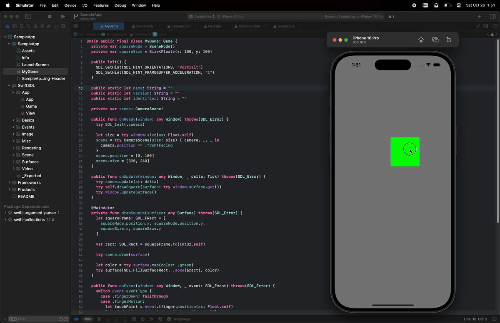

# SwiftSDL — Cross-Platform Targets with Swift & SDL3

## Overview

**SwiftSDL** is an open-source Swift library that provides a convenient interface for working with the C-based [SDL (Simple DirectMedia Layer)](https://www.libsdl.org/) library. This wrapper allows developers to leverage SDL's cross-platform multimedia and game development capabilities in Swift applications across macOS, Linux, Windows, and iOS.

The library integrates seamlessly with the **Swift Package Manager (SPM)**, making it simple to manage dependencies and build your projects without requiring a framework file on macOS. In addition, the library includes a **sample application** for iOS to demonstrate how to integrate SDL within iOS apps using a bridging header.

## Features

- Swift wrapper for the SDL library (vers. 3), exposing SDL's core functionality in an easy-to-use Swift API.
- Cross-platform support for macOS, Linux, and Windows, with simplified project management using the Swift Package Manager.
- iOS support using Objective-C to Swift bridging for SDL integration.
- A sample iOS application that demonstrates how to set up and use SDL3 with this library.

## Sample Code

Below is a basic example of how you can use SwiftSDL to initialize an SDL window in Swift:

| `Example.swift`  | Output  |
|---|---|
|<pre width="0" lang="swift">import SwiftSDL&#13;&#13;@main final class Example: Game {&#13;  func onReady(window: any Window) throws(SDL_Error) { }&#13;  func onUpdate(window: any Window, _ delta: Tick) throws(SDL_Error) {&#13;    let surface = try window.surface.get()&#13;    try surface.clear(color: .red)&#13;    try window.updateSurface()&#13;  }&#13;  func onEvent(window: any Window, _ event: SDL_Event) throws(SDL_Error) { }&#13;  func onShutdown(window: any SwiftSDL.Window) throws(SwiftSDL.SDL_Error) { }&#13;}</pre> |  |

## Installation

### Swift Package Manager (SPM)

You can add **SwiftSDL** as a dependency in your project by adding the following to your `Package.swift` file:

```swift
// swift-tools-version: 6.0
// The swift-tools-version declares the minimum version of Swift required to build this package.

import PackageDescription

let package = Package(
  name: "SwiftSDLTest",
  platforms: [.macOS(.v10_15)],
  dependencies: [
    .package(url: "https://github.com/KevinVitale/SwiftSDL.git", from: "0.2.0-alpha.4"),
  ],
  targets: [
    .executableTarget(
      name: "SwiftSDLTest",
      dependencies: ["SwiftSDL"],

      // Optional: bundle resources!
      resources: [
        .process("../Resources/BMP")
      ],

      // Required: when using SPM YOU MUST
      // have libSDL3.{dylib|so|a} installed.
      linkerSettings: [.unsafeFlags(
        [
          "-Xlinker", "-F", "-Xlinker", "/usr/local/lib",
          "-Xlinker", "-rpath", "-Xlinker", "/usr/local/lib",
        ], .when(platforms: [.macOS])
      )]
    ),
  ]
)
```

### CMake (for non-SPM platforms)

```
// TODO
```

## Platform-Specific Instructions

### macOS


### Linux


### Windows

### iOS
Due to platform differences, integrating SDL on iOS requires an **Objective-C to Swift Bridging Header**. The library includes a sample project to demonstrate this setup.

1. **Create a Bridging Header**:
    - In your iOS project, create a bridging header file (e.g., `YourApp-Bridging-Header.h`) and include SDL's necessary headers:

    ```objective-c
    #include "SDL.h"
    #include "SDL_main.h"
    ```

2. **Link the SDL Framework**:
    - Make sure to link the SDL framework in your Xcode project. This is necessary for building and running the iOS version of the app.

3. **Sample App**:
    - The library includes a sample iOS app in the `Examples/iOS` directory. Open the project in Xcode, ensure the bridging header is set up correctly, and build the app to see how SDL can be used in iOS apps.



## Contributions

**Fix Me:** Something like:

> _We welcome contributions from the community! Feel free to fork the repository, submit issues, or create pull requests. Be sure to follow the contribution guidelines and coding standards outlined in `CONTRIBUTING.md`._

## License

SwiftSDL is open-sourced under the MIT license. See the `LICENSE` file for details.

## Contact

**Fix Me:** Something like:

> _For questions or further assistance, please reach out via GitHub issues or contact the maintainers directly at `email@example.com`._

---

With **SwiftSDL**, you can effortlessly bring SDL's cross-platform multimedia power into the world of Swift!
