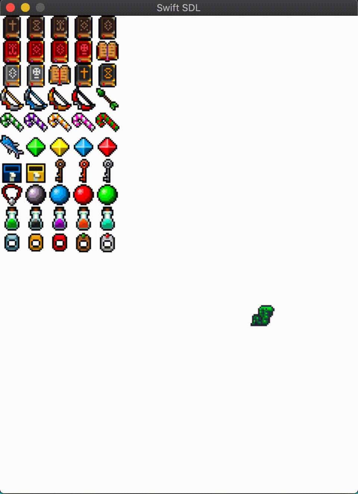
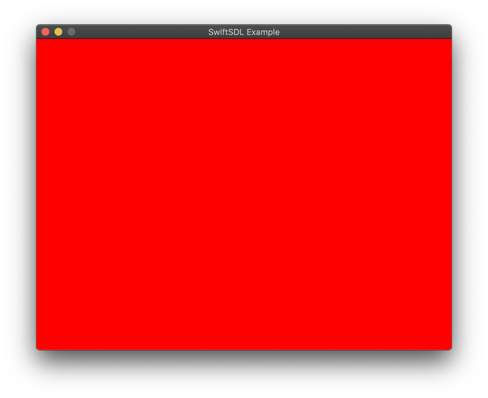

# SwiftSDL

[Simple DirectMedia Layer](https://libsdl.org) is a cross-platform development library designed 
to provide low level access to audio, keyboard, mouse, joystick, and graphics hardware.

This project provides a lightweight wrapper around _SDL_ which makes its C-based API easy and
intiutive to use from _Swift_.

<hr/>

 

## Testing It Out
Use `Homebrew` to install the `SDL2` dependency, and then run `DemoSDL2`:

```bash
# Install Deps
$ brew install sdl2 sdl2_image

# Pull Repo
$ git clone https://github.com/KevinVitale/SwiftSDL.git

# Run DemoSDL2
$ cd SwiftSDL
$ make && make run
```

## Quick Start
Using `SDL.Run { engine in /*...*/ }` gets you a game loop quickly:

```swift
import Foundation
import CSDL2
import SwiftSDL2

try SDL.Run { engine in
    // Start engine ------------------------------------------------------------
    try engine.start(subsystems: .video)
    
    // Create renderer ---------------------------------------------------------
    let (window, renderer) = try engine.addWindow(width: 640, height: 480)
    
    // Handle input ------------------------------------------------------------
    engine.handleInput = { [weak engine] in
        var event = SDL_Event()
        while(SDL_PollEvent(&event) != 0) {
            if event.type == SDL_QUIT.rawValue {
                engine?.removeWindow(window)
                engine?.stop()
            }
        }
    }
    
    // Render ------------------------------------------------------------------
    engine.render = {
        renderer.result(of: SDL_SetRenderDrawColor, 255, 0, 0, 255)
        renderer.result(of: SDL_RenderClear)
        
        /* Draw your stuff */
        
        renderer.pass(to: SDL_RenderPresent)
    } 
}
```




## Overview
SDL objects are subclasses of `SDLPointer<SDLType>`. These include (but are not limited to):
  - `SDLWindow`
  - `SDLRenderer`
  - `SDLTexture`
  - `SDLSurface`

`SDLType` is a protocol which describes how the underlying SDL object is freed. Here is an example of `SDLWindow`:

```swift
public final class SDLWindow: SDLPointer<SDLWindow>, SDLType {
    public static func destroy(pointer: OpaquePointer) {
        SDL_DestroyWindow(pointer)
    }
}
```

### Methodology of `SDLPointer<SDLType>`
`SDLPointer<SDLType>` has just two functions:
  - `result(of:)` is used for `SDL2` functions which return errors; and,
  - `pass(to:)` is used for `SDL2` functions that don't error-out.
  
You're able to call them on `Optional` instances of `SDLPointer<SDLType>`, foregoing the need to constantly be checking for `nil`.
  
#### `result(of:)`
Some SDL function calls can return error codes. In these cases, use `result(of:)`. For example, when setting the renderer's draw color:

```swift
// Create renderer ---------------------------------------------------------
let (window, renderer) = try engine.addWindow(width: 640, height: 480)

// Render ------------------------------------------------------------------
engine.render = {
    do {
        try renderer.result(of: SDL_SetRenderDrawColor, 255, 255, 255, 255).get()
        try renderer.result(of: SDL_RenderClear).get()

        /* Draw your stuff */

        renderer.pass(to: SDL_RenderPresent)        
    } catch {
        print(error)
    }
} 
```

##### When should I handle SDL errors?
You have total freedom for deciding when it is necessary for your application to handle potential errors; `result(of:)` has a `Void` as its `Success` type. You may decide to ignore the `Result` being returned, or call `try...get()` if you're interested in handling potential errors.

#### `pass(to:)`
Let's say you wanted to use `IMG_LoadTexture` to create a new texture object. Here is the interface for this function:

```swift
func IMG_LoadTexture(_ renderer: OpaquePointer!, _ file: UnsafePointer<Int8>!) -> OpaquePointer!
```

Like nearly all SDL functions which get exposed to Swift, we need to pass an `OpaquePointer!` as the first argument. Following that, a C-string'd `file` path is needed as the second argument. 

Let's look at how `pass(to:)` is used to help us with this when loading a texture from a file:

```swift
let texturePathURL = Bundle.main.resourceURL!.appendingPathComponent("block.png")
let texture = renderer
    .pass(to: IMG_LoadTexture, texturePathURL.path)
    .map(SDLTexture.init)
```

In just a few lines of code, we've called `IMG_LoadTexture` and created new `SDLTexture` instance from the pointer returned by `IMG_LoadTexture`.   

## More Examples
Let's see more of `SDLPointer<SDLType>` in action! 🎉

### Get the renderer's output size

For example, to read the `width` and `height` of a renderer's output size:
```swift
let renderer: SDLRenderer? = /* returned elsewhere */
// Get logical renderer size ---------------------------------------------------
do {
    var width: Int32 = .zero, height: Int32 = .zero
    try renderer?.result(of: SDL_GetRendererOutputSize, &width, &height).get()
    print("\(width) x \(height)")
} catch {
    print(error)
}
```

## License
```
Copyright (c) 2019 Kevin J. Vitale

Permission is hereby granted, free of charge, to any person obtaining a copy 
of this software and associated documentation files (the "Software"), to deal 
in the Software without restriction, including without limitation the rights 
to use, copy, modify, merge, publish, distribute, sublicense, and/or sell copies 
of the Software, and to permit persons to whom the Software is furnished to do so, 
subject to the following conditions:

The above copyright notice and this permission notice shall be included in all 
copies or substantial portions of the Software.

THE SOFTWARE IS PROVIDED "AS IS", WITHOUT WARRANTY OF ANY KIND, EXPRESS OR IMPLIED, 
INCLUDING BUT NOT LIMITED TO THE WARRANTIES OF MERCHANTABILITY, FITNESS FOR A 
PARTICULAR PURPOSE AND NONINFRINGEMENT. IN NO EVENT SHALL THE AUTHORS OR COPYRIGHT 
HOLDERS BE LIABLE FOR ANY CLAIM, DAMAGES OR OTHER LIABILITY, WHETHER IN AN ACTION 
OF CONTRACT, TORT OR OTHERWISE, ARISING FROM, OUT OF OR IN CONNECTION WITH THE SOFTWARE 
OR THE USE OR OTHER DEALINGS IN THE SOFTWARE.
```
